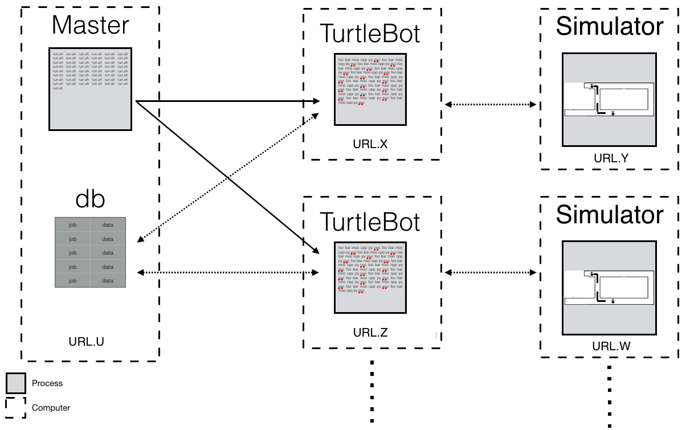

# Infrastructure

This folder contains the scripts used to measure the performance and behavior 
of the TurtleBot. It uses a combination of Python, bash, and R scripts to execute 
and monitor TurtleBot, and graph the results to compare and analyze the execution.

The following picture presents a view of the infrastructure

The master machine can run any OS. The TurtleBot and Simulator machines have to run
Linux.

## Technical Requirements

* [ROS Indigo](http://wiki.ros.org/indigo/Installation/Ubuntu) (Required. Install in TurtleBot 
and Simulator machines)

  This is the version of ROS used for the experiments.

* [TurtleBot Indigo](http://wiki.ros.org/turtlebot/Tutorials/indigo/Turtlebot%20Installation) (Required. 
Install in TurtleBot and Simulator machines)

  This is the TurtleBot simulator for the Indigo version of ROS.

* [Jetway](https://github.com/miguelvelezmj25/Jetway)
  
  This is a forked repo from Christian Kästner and adapted for this project. It is mainly used to communicate 
with a database. 

* [Fabric](http://www.fabfile.org/) (Optional. Install in master machine)
  
  This command-line tool is installed and used in the master machine for streamlining 
the use of SSH for application deployment or systems administration tasks. It is
used to send jobs and manage the machines that execute the experiments

* [Fabfiles](https://github.com/miguelvelezmj25/fabfiles) (Optional. Clone in master machine)

  This project contains a collection of fabfiles used along side Fabric to manage and
send jobs to multiple machines. This project contains files needed in the simulator machine
if you run your experiments headless. It also contains scripts for running the experiments.

* sshpass (Required. Install in TurtleBot machine)

  This Linux utility allows to run ssh using the mode referred to as "keyboard-interactive" 
password authentication, but in non-interactive mode. This is used in a bash scripts
to initialize and terminate processes for the gazebo simulator in order machines. You 
can install it by typing:
 
        sudo apt-get install sshpass

* mpstat (Required. Install in TurtleBot machine)

  Part of Sysstat. This Linux command writes to standard output activities for each available processor.
It is used to measure CPU utilization of an entire machine. You can install it by typing:
 
        sudo apt-get install sysstat

* Xorg dummy driver (Required to run the simulator headless. Install in  Simulator machine)

  This driver allows to run the simulator headless. You can install it by typing:
 
        sudo apt-get install xserver-xorg-video-dummy

## Additional Files

The following files contain sensitive data that is unique to each individual who uses this
repo. Therefore, they are not provided in this repo and must be installed in the machines running
the TurtleBot and Simulator. 

* .dbconfig
  
  This file is used to connect to the database that stores the jobs and saves the data from
the executions. It must have the following structure:

        [section]
        hostname = hostname
        user = user
        password = password
        database = database

* .serverconfig

  This file is used to configure the communication between the TurtleBot and Simulator machines.
It mus have the following structure:

        [section]
        simulator = simulator
        username = username
        password = password

## Database

This project requires a database to store the configurations of TurtleBot, the time
series and summary measurements, the non-functional properties to be measured, and
jobs to do. The following is the DDL from the database currently used.

    CREATE TABLE nfps
    (
        id INT(11) unsigned PRIMARY KEY NOT NULL AUTO_INCREMENT,
        name VARCHAR(300) DEFAULT '' NOT NULL,
        created_at TIMESTAMP DEFAULT CURRENT_TIMESTAMP NOT NULL
    );
    CREATE TABLE todos
    (
        configuration_id VARCHAR(36) DEFAULT '' NOT NULL,
        iterations INT(11) NOT NULL,
        worker VARCHAR(100) DEFAULT '' NOT NULL,
        priority INT(11),
        created_at TIMESTAMP DEFAULT CURRENT_TIMESTAMP NOT NULL,
        CONSTRAINT `PRIMARY` PRIMARY KEY (configuration_id, worker),
        CONSTRAINT todos_configurations_id_fk FOREIGN KEY (configuration_id) REFERENCES configurations (id)
    );
    CREATE TABLE configurations
    (
        id VARCHAR(36) PRIMARY KEY NOT NULL,
        options VARCHAR(760) DEFAULT '' NOT NULL,
        created_at TIMESTAMP DEFAULT CURRENT_TIMESTAMP NOT NULL
    );
    CREATE UNIQUE INDEX configurations_options_uindex ON configurations (options);
    CREATE TABLE measurements_verbose
    (
        configuration_id VARCHAR(36) DEFAULT '' NOT NULL,
        simulator VARCHAR(30) DEFAULT '' NOT NULL,
        host VARCHAR(30) DEFAULT '' NOT NULL,
        nfp_id INT(11) unsigned NOT NULL,
        value VARCHAR(20) DEFAULT '' NOT NULL,
        time VARCHAR(20) DEFAULT '' NOT NULL,
        created_at TIMESTAMP DEFAULT CURRENT_TIMESTAMP NOT NULL,
        CONSTRAINT measurements_verbose_configurations_id_fk FOREIGN KEY (configuration_id) REFERENCES configurations (id),
        CONSTRAINT measurements_verbose_nfps_id_fk FOREIGN KEY (nfp_id) REFERENCES nfps (id)
    );
    CREATE INDEX measurements_verbose_configurations_id_fk ON measurements_verbose (configuration_id);
    CREATE INDEX measurements_verbose_nfps_id_fk ON measurements_verbose (nfp_id);
    CREATE TABLE measurements
    (
        configuration_id VARCHAR(36) DEFAULT '' NOT NULL,
        simulator VARCHAR(30) DEFAULT '' NOT NULL,
        host VARCHAR(30) DEFAULT '' NOT NULL,
        nfp_id INT(11) unsigned NOT NULL,
        value VARCHAR(20),
        created_at TIMESTAMP DEFAULT CURRENT_TIMESTAMP NOT NULL,
        CONSTRAINT measurements_configurations_id_fk FOREIGN KEY (configuration_id) REFERENCES configurations (id),
        CONSTRAINT measurements_nfps_id_fk FOREIGN KEY (nfp_id) REFERENCES nfps (id)
    );
    CREATE INDEX measurements_configurations_id_fk ON measurements (configuration_id);
    CREATE INDEX measurements_nfps_id_fk ON measurements (nfp_id);
       
## Running Experiments

TODO. The [Fabfiles](https://github.com/miguelvelezmj25/fabfiles) repo contains scripts
and information to run the experiments.